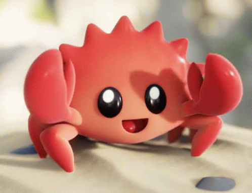

# Rust Language Learning 🦀

My compilation of Rust learnings and topics from what I can understand, and also to keep a record on what i've learned in Rust through various sources. 🦀

I want to just focus on Rust and see what I can do with using the Rust Language. 🦀

And try to commit to Github atleast everyday no matter how small or ugly the code is still commit it until my Todo List is complete. 🦀

<!-- Task List -->
## TODO: 🦀
* [x] Finish Chapter 6
* [x] Create a small project (After Chapter 6)
* [x] Continue with The Book(Chapter 7 - Chapter 10)
* [ ] Attempt to create some small to medium sized project with Rust